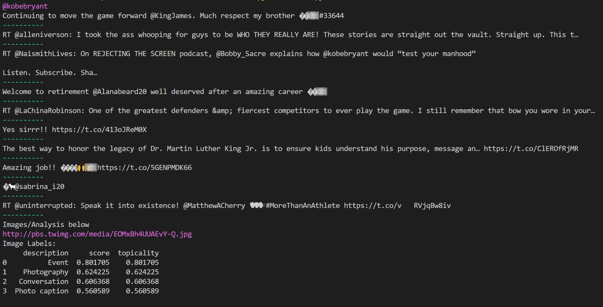

# twitter-summarizer-brianhe12
Module with an API that will return to the user of the API in text the twitter feed summary (Twitter Feeds and Text description of the images)

### Built with:

[Tweepy](http://docs.tweepy.org/en/latest/#)

[Google Vision API](https://cloud.google.com/vision)

We have one method that receives a person's Twitter handle and an integer value indicating the number of recent tweets the user of the API wants to display.
```python
api_print(twitter_handle,numTweets)
```
### Example Usage
```python
# user.py
import google_twitter_api 

google_twitter_api.api_print("kobebryant",10)
```
This function call will print out the 10 most recent tweets of [@kobebryant](https://twitter.com/kobebryant) and use Google's Vision API to analyze any images in those tweets.

### Example Output

